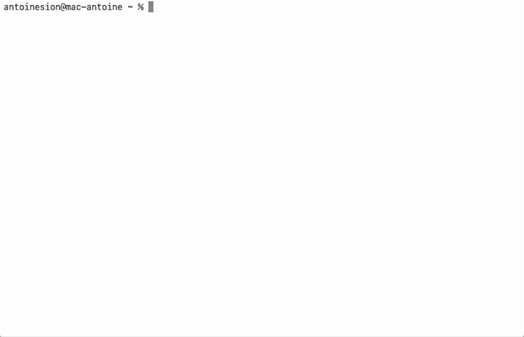

# toDO
The Command Line TO-DO list app

#### Preview
Here a preview of the main functionalities.

#### Funtionalities
You can, among things,
* create tasks
* add subtasks
* list your tasks with filters and/or sorting ways
* add comments to your tasks
* change the tasks progression
* organize your tasks the way you want

### Installation
1. Download this repository using `git clone https://github.com/antoinesion/toDO.git`.
2. Put the `toDO/` directory where you want (do this before configuration).
3. In the `toDO/` directory, type `./config` and press `ENTER`.
4. Then, use `make` command.
5. Finally, type `./install ~/.your_shrc` replacing `.your_shrc` by your shell startup file such as *.bashrc*, *.bash_profile* or *.zshrc*.
6. Restart your terminal and start creating tasks!

#### Update
It is very easy to update the app, you just have to type `./update` in the `toDO/` directory and press `ENTER`.

### Documentation
In `docs/`directory, you can find:
* `DOC_USER.md` to learn about how to use the app.
* `DOC_DEV.md` to learn about how the app is coded.

